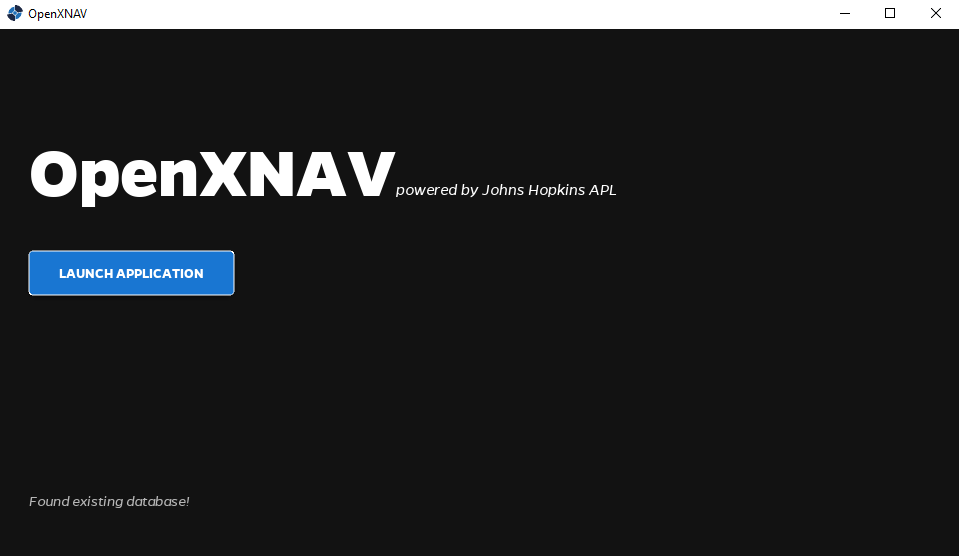
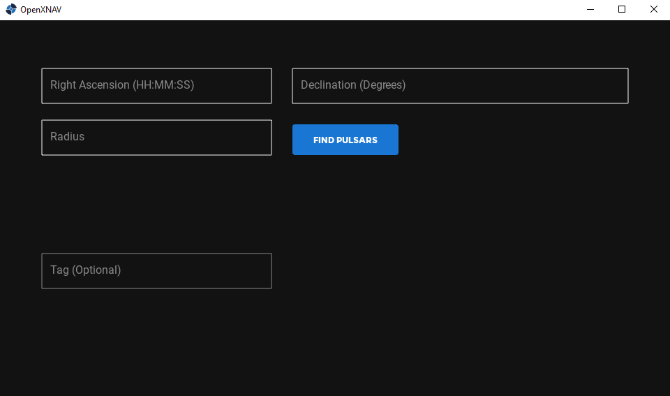
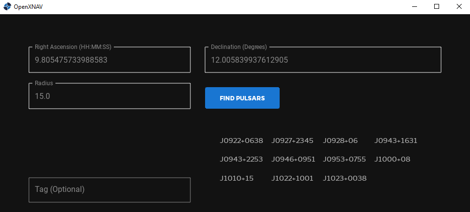
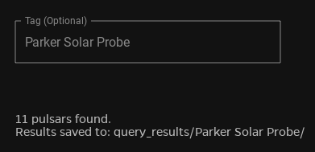

# **Pulsar Querying**

## **Installation** 
Before using the OpenXNAV Pulsar Querying Tool, you will need to install the necessary python packages. You can do this using your preferred python package manager, but instructions are provided below for using ```Anaconda```

Inside the ```open-xnav/1__pulsar_querying/``` directory, there is an ```environment.yml``` file. This file can be passed to your preferred package manager to create a new environment that can run the tool. 

### **Create New Environment**

The default environment name in ```environment.yml``` is ```openXNAV-gui```. If you wish to change the environment name, simply edit ```environment.yml``` before creating the environment. 

Open your Anaconda Prompt (or activate Anaconda in a terminal window). Navigate to ```open-xnav/`1__pulsar_querying/``` and run the following command: 
```shell
conda env create -f environment.yaml
```

To activate your environment, run the following command: 
```shell
conda activate openXNAV-gui
```
NOTE: If you altered the environment name, you will need to alter the above command to reflect that new name. 


### **Install KivyMD**

The tool also depends on [KivyMD](https://kivymd.readthedocs.io/en/latest/), which is a library built off of the popular [Kivy](https://kivy.org/) library. This package is not available through ```conda```, so you must install it using ```pip```. 

First, make sure you have activated the ```openXNAV-gui ``` environment in your terminal. Then, run the following command: 

```shell
pip install kivymd
```

If you are getting a ```ReadTimeoutError``` response during installation, you might be using a VPN or have a slower internet connection. If this happens, try running the following instead: 

```shell
pip install --default-timeout=1000 kivymd
```

If that still does not work, you can troubleshoot your issues further using the ```pip``` documentation [here](https://pip.pypa.io/en/stable/user_guide/). 


## **Using The Tool**

### **Load/Generate Database**

Once you have successfully installed all the required packages, you are ready to run the tool!

First, ensure you have navigated to ```open-xnav/1__pulsar_querying/``` in your terminal and have your ```openXNAV-gui``` environment activated. 

Then, simply run the following in your terminal: 
```shell
python run.py
```

Upon startup, the tool will need to pull the current ATNF Pulsar Catalogue from the web. This process only need to be done the first time you open the application. 


However, if you wish to update the database, simply delete the ```.../pulsar_database/``` directory from your file system. Then, relaunch the application. Once the database has been generated, you can continue begin querying. 


You should see the OpenXNAV launch window with the blue ```Launch Application``` button active. In the future, when you open the application, the tool will locate the previously-generated database and you can quickly continue to the querying functionality.




### **Query For Pulsars**

After you click ```Launch Application```, the query tool will display.



There are three fields that you need to provide to execute a query: 

- **Right Ascension** (HH:MM:SS)
- **Declination** (DD:MM:SS)
- **Search Radius** (Degrees)

These values will create a query, searching for all known pulsars that are within a given search radius of the provided coordinates in space. 

The OpenXNAV tool leverages the open-source ```psrqpy``` library. More information about this package, and how queries are executed, can be found [here](https://psrqpy.readthedocs.io/en/latest/query.html).

The query results will display to the GUI interface, and will also be stored in a sub-directory within ```.../query_results/```. 



For information about how these sub-directories are tagged, see below. 

#### Tagging Results

There is an optional ```Tag``` field that OpenXNAV also provides. This allows you to specify the tag for this query you are about to execute. If a tag is provided, that will be used to name the sub-directory within ```.../query_results/``` where all pulsars returned by the query are stored. 



**Sample Queries**

Below are couple sample queries that you can run to get familiar with the OpenXNAV tool. There are additional sample query results contained in the ```.../query_results/``` directory. 

|    Query    | Right Ascension | Declination | Radius |
| --------------------- | ----------- | ----------- | ----------- |
| *Parker Solar Probe* | 9.805475733988583 | 12.005839937612905 | 15.0 |
| *L2* | 18:24:32.00819 | -24:52:10.720 | 30.0 |


## **Output Files**

### **STK Integration**

Right now, the OpenXNAV Pulsar Querying Tool only outputs pulsar data into the ```.st``` format. This is the format that is required by STK to perform subsequent mission planning. 

To display the format of this file, here is ```J00012_5431.st``` as an example: 

```
stk.v.12.0
WrittenBy    OpenXNAV

BEGIN Star

    Name		 J0012_5431

    BEGIN PathDescription

        Epoch		  58912.0
        RefFrame		 J2000
        RightAscension		  3.097083333333333
        Declination		  +54:31:47
        ProperMotionRAPerYr		 0
        ProperMotionDecPerYr		 0
        Parallax		  0
        RadialVelocity		  0.0000000000000000e+00

    END PathDescription

    BEGIN PhysicalData

        Magnitude		  None

    END PhysicalData

    BEGIN IdentityData

        Id		 0

    END IdentityData


    BEGIN Extensions

        BEGIN ExternData
        END ExternData

        BEGIN ADFFileData
        END ADFFileData

        BEGIN AccessConstraints
            LineOfSight IncludeIntervals

            UsePreferredMaxStep No
            PreferredMaxStep 360
        END AccessConstraints

        BEGIN Desc
        END Desc

        BEGIN Crdn
        END Crdn

        BEGIN Graphics

            BEGIN Attributes

                MarkerColor		 #00ff00
                LabelColor		 #00ff00
                MarkerStyle		 2
                FontStyle		 0

            END Attributes

            BEGIN Graphics

                Show		 On
                Inherit		 On
                ShowLabel		 On
                ShowMarker		 On

            END Graphics
        END Graphics

        BEGIN VO
        END VO

    END Extensions

END Star
```

You will need to provide these ```.st``` file(s) to STK to successfully execute OpenXNAV's mission planning functionality. 

### **Other File Formats**

However, if you would like pulsar information to be stored/saved in a different format, you can modify the source code. 

Navigate to ```queryPulsar.py``` and locate the following function: 
```python
def saveToFile(self, root_directory) ...
```
Here, you can alter/update the code to print the pulsar information into your desired format. Once this function has been updated, query results will automatically store in this new format. All query results will still appear in ```.../query_results/```.

